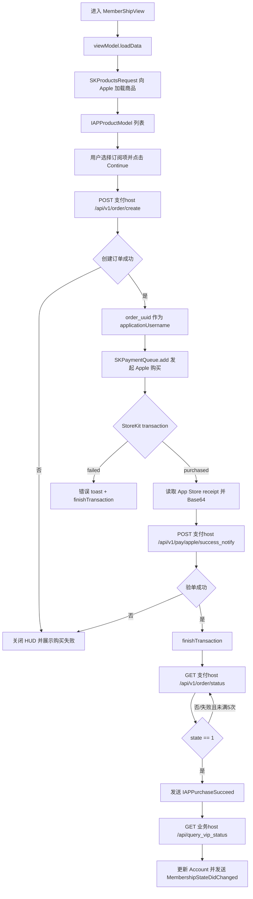

# 支付体系

本文档梳理 App 内购支付体系，重点说明会员订阅从获取商品、创建订单、发起 Apple 购买、读取票据、后端验单、查询订单状态到刷新权益的完整 workflow，并明确各接口使用的 host。

## 支付模块

| 文件 | 职责 |
| --- | --- |
| `Pixnova/BasicBundle/IAP/IAPManager.swift` | StoreKit 商品加载、购买、恢复、交易监听、订单状态轮询 |
| `Pixnova/BasicBundle/IAP/IAPService.swift` | 后端订单、验单、恢复验单、会员状态查询 |
| `Pixnova/BasicBundle/IAP/IAPModel.swift` | 商品模型、交易模型、价格格式化 |
| `Pixnova/Views/MemberShip/MemberShipView/MemberShipView.swift` | 会员订阅页 UI |
| `Pixnova/Views/MemberShip/MemberShipView/MembershipViewCustomViewModel.swift` | 当前会员页使用的商品加载、购买、恢复逻辑 |
| `Pixnova/Views/MemberShip/MemberShipViewModel.swift` | 新人折扣页等旧会员购买页使用的 ViewModel |
| `Pixnova/Views/VideoPage/VideoGeneratePurchase/DiamondPurchaseModel.swift` | 钻石消耗型商品购买，复用同一 IAP 底座 |
| `Pixnova/BasicBundle/Network/BaseBusinessServer.swift` | 通过 `specialHost` 支持支付接口独立 host |
| `Pixnova/BasicBundle/Network/Server.swift` | `RBXServer.baseURL`、header、支付 host 判定 |
| `Pixnova/BasicBundle/Network/ServerResponse.swift` | 支付 host 响应不按普通业务 `code == 0` 校验 |

## Host 划分

当前工程有两类后端 host：

| 类型 | Host | 使用场景 |
| --- | --- | --- |
| App 业务 host | `SERVER_HOST = https://api.pixnova.app` | 登录、权益查询、恢复 token、业务数据等 |
| 支付 Debug host | `https://pay-vmddzvrudq-df.a.run.app` | Debug 环境订单/验单/订单状态/恢复验单 |
| 支付 Release host | `https://pay-mhsaciltta-wl.a.run.app` | Release 环境订单/验单/订单状态/恢复验单 |

`IAPService.baseUrl()` 根据编译环境返回支付 host：

```swift
let PaymentBaseUrl_Debug = "https://pay-vmddzvrudq-df.a.run.app"
let PaymentBaseUrl_Release = "https://pay-mhsaciltta-wl.a.run.app"

class func baseUrl() -> String {
    var url = PaymentBaseUrl_Release
    DebugOnly {
        url = PaymentBaseUrl_Debug
    }
    return url
}
```

`BaseBusinessServer.requestWith(specialHost:path:method:params:)` 会把 `specialHost` 写入 `API.specialHost`。`RBXServer.baseURL` 优先使用 `specialHost`，否则使用 `SERVER_HOST`。

注意：`IAPService.getMembershipState()` 没有传 `specialHost`，所以它虽然定义在 `IAPService` 中，但实际走 App 业务 host；订单创建、验单、订单状态、Apple 恢复验单都显式传了 `specialHost: IAPService.baseUrl()`，实际走支付 host。

## 接口总览

| 阶段 | 方法 | Path | Host | 调用点 | 说明 |
| --- | --- | --- | --- | --- | --- |
| 加载商品 | StoreKit `SKProductsRequest` | Apple App Store | Apple | `IAPManager.loadProducts` | 根据 product id 拉取 `SKProduct` |
| 创建订单 | POST | `/api/v1/order/create` | 支付 host | `IAPService.createOrder` | Apple 购买前创建业务订单 |
| Apple 购买 | StoreKit `SKPaymentQueue.add` | Apple App Store | Apple | `IAPManager.purchaseProduct` | 发起系统内购 |
| 验单 | POST | `/api/v1/pay/apple/success_notify` | 支付 host | `IAPService.verifyPayment` | 把 Apple receipt 和 transaction id 发给支付服务 |
| 查询订单状态 | GET | `/api/v1/order/status` | 支付 host | `IAPService.checkOrderState` | `state == 1` 认为订单完成 |
| 刷新会员权益 | GET | `/api/query_vip_status` | App 业务 host | `IAPService.getMembershipState` | 更新 VIP、视频次数、钻石等本地账号状态 |
| Apple 恢复验单 | POST | `/api/v1/pay/apple/restore` | 支付 host | `IAPService.restoreVerifyPayment` | 恢复购买时验证 original transaction |
| 恢复用户 token/权益 | POST | `/api/restore_user_id` | App 业务 host | `AccountManager.restoreToken` | 恢复购买后把交易 id 交给业务服务换 token/权益 |

## 订阅商品来源

会员商品 id 定义在 `IAPManager.swift`：

```swift
let ONLINEyearlyMembershipNewMemberProductId = "Pixnova.vip.yearly.online.nofreetrail.newfriend"
let ONLINEweeklyMembershipNewMemberProductId = "Pixnova.vip.weekly.online.nofreetrail.newfriend"
let ONLINElimityearlyMembershipNewMemberProductId = "Pixnova.vip.yearly.online.nofreetrail.newuserdiscount"
let ONLINEAlertOffCutWeekMemberShipProductId = "Pixnova.vip.weekly.449.nofreetrail"
```

`IAPManager.productIds` 初始包含：

1. `ONLINEAlertOffCutWeekMemberShipProductId`
2. `AccountManager.default.currentAccount.getAccountIndividuationProductID()` 返回的个性化会员商品
3. `ONLINElimityearlyMembershipNewMemberProductId`

当前主会员页 `MemberShipView` 使用 `MembershipViewCustomViewModel`，其 `loadData()` 只加载：

```swift
AccountManager.default.currentAccount.getAccountIndividuationProductID()
```

新人折扣页 `MemberShipDiscountPage` 使用旧 `MemberShipViewModel`，它会加载 `IAPManager.shared.productIds`，并使用 `newMemberProduct` 等特殊商品。

## 订阅开通 Workflow

### 1. 进入会员页并加载商品

`MemberShipView.onAppear`：

```swift
viewModel.loadData()
```

`MembershipViewCustomViewModel.loadData()`：

1. 根据账号个性化配置决定 `freeEnable` 是否打开。
2. 读取审核/展示开关 `LaunchConfig.share.AppCanHappyShow`。
3. 调 `IAPManager.shared.loadProducts(productIds:)`。

`IAPManager.loadProducts` 的行为：

1. 先查 `availableProducts` 缓存。
2. 缓存命中则直接回调。
3. 未命中的 product id 通过 `SKProductsRequest(productIdentifiers:)` 向 Apple 拉取。
4. `productsRequest(_:didReceive:)` 把 `SKProduct` 缓存在 `availableProducts`。
5. ViewModel 把 `SKProduct` 包装成 `IAPProductModel`，按 product id 是否包含 `nofreetrail` 分到：
   - `productListWithoutFree`
   - `productListWithFree`

`IAPProductModel` 会从 `SKProduct` 生成：

- `id = product.productIdentifier`
- `title = product.localizedTitle`
- `price = product.price` 按 `priceLocale` 格式化后的本地货币价格
- `promotionDetail`
- `subscribeDesc`
- `weeklyPriceFormYearlyProduct`

### 2. 用户选择订阅项

`MembershipViewCustomViewModel.selectedProduct` 根据 UI 状态返回当前购买项：

- `freeEnable == true`：优先从 `productListWithFree` 找周/年商品。
- `freeEnable == false`：按 `selectedProductIndex` 从 `productListWithoutFree` 找周/年商品。

当前 `isPushWeekVip()` 固定返回 `false`，所以默认偏向 yearly 商品；另一个位置可切换到另一个周期商品。

### 3. 点击 Continue / Start Free Trail

`MemberShipView` 按钮点击：

```swift
viewModel.purchasingWithCurrentSelectedProduct(viewLoadingSourceParam)
```

ViewModel 做 UI 和埋点准备：

1. `toastContent = "purchasing..."`
2. `hudNeeded = true`
3. 记录“点击订阅”埋点。
4. 调 `IAPManager.shared.payment(model: product)`。

### 4. 后端创建订单

`IAPManager.payment` 第一步：

```swift
IAPService.createOrder(model: model) { orderId, appAccountToken, error in ... }
```

接口：

```text
POST {PaymentBaseUrl}/api/v1/order/create
```

Host：

- Debug：`https://pay-vmddzvrudq-df.a.run.app`
- Release：`https://pay-mhsaciltta-wl.a.run.app`

请求体：

```json
{
  "name": "SKProduct.localizedTitle",
  "description": "SKProduct.localizedDescription",
  "product_id": "Pixnova.vip.yearly...",
  "purchase_price": "$39.99"
}
```

成功响应需要包含：

```json
{
  "data": {
    "order_id": "server_order_id",
    "order_uuid": "uuid-string"
  }
}
```

客户端处理：

- `order_id` 保存为本次后端订单号。
- `order_uuid` 转成 `UUID`，作为 Apple 支付的 `applicationUsername`。

如果创建订单失败，`IAPManager.payment` 直接把错误回给 ViewModel，ViewModel 关闭 HUD 并展示购买失败 toast。

### 5. 发起 Apple StoreKit 购买

创建订单成功后：

```swift
self.purchaseProduct(product: model.product, orderId: orderId, appAccountToken: appAccountToken)
```

`IAPManager.purchaseProduct`：

```swift
let payment = SKMutablePayment(product: product)
payment.applicationUsername = appAccountToken.uuidString
SKPaymentQueue.default().add(payment)
```

关键点：

- `applicationUsername` 使用后端订单返回的 `order_uuid`，用于 Apple 交易和服务端订单关联。
- `purchaseProductRequests` 以 `productId` 缓存当前购买回调。
- `IAPManager.init()` 会 `addTransactionObserver()`，监听 `SKPaymentQueue` 交易状态。

### 6. StoreKit 回调 purchased

`paymentQueue(_:updatedTransactions:)` 收到交易状态：

- `.purchasing`：只记录日志。
- `.purchased`：调用 `completeTransaction(transaction:)`。
- `.failed`：调用 `failedTransaction(transaction:)`，然后 `finishTransaction`。
- `.restored`：当前交易监听里直接 `finishTransaction`；主动恢复购买走 `restoreCompletedTransactions` 结束回调。

`completeTransaction` 会：

1. 用 `transaction.payment.productIdentifier` 找到之前缓存的购买回调。
2. 从 `Bundle.main.appStoreReceiptURL` 读取 App Store receipt。
3. 将 receipt 转成 Base64。
4. 构造 `IAPTransactionModel`：
   - `transaction`
   - `productId`
   - `userId`
   - `transactionId`
   - `receiptData`
   - `receiptDataBase64String`
5. 回调给 `IAPManager.payment` 继续验单。

如果 receipt URL 不存在或读取失败：

- 回调错误。
- 调 `SKPaymentQueue.default().finishTransaction(transaction)` 结束 Apple 交易。

### 7. 后端校验票据

`IAPManager.payment` 拿到 `IAPTransactionModel` 后调用：

```swift
IAPService.verifyPayment(
    orderId: orderId,
    transactionId: transationModel.transactionId,
    receiptData: transationModel.receiptDataBase64String
)
```

接口：

```text
POST {PaymentBaseUrl}/api/v1/pay/apple/success_notify
```

Host：

- Debug：`https://pay-vmddzvrudq-df.a.run.app`
- Release：`https://pay-mhsaciltta-wl.a.run.app`

请求体：

```json
{
  "order_id": "server_order_id",
  "transaction_id": "apple_transaction_id",
  "receipt_data": "base64_app_store_receipt"
}
```

支付 host 的响应处理比较特殊：

- `ServerResponse.api_request` 发现 `baseURL` 包含 `PaymentBaseUrl_Debug` 或 `PaymentBaseUrl_Release` 时，不再要求响应里有业务 `code == 0`。
- 只要 HTTP 状态码是 2xx 且 JSON 能解析，就作为 success 回调给业务层。

验单成功后：

1. ViewModel 的购买回调先收到 `complete(nil)`。
2. `SKPaymentQueue.default().finishTransaction(transationModel.transaction)` 关闭 Apple 交易。
3. 调 `checkOrderState(orderId:)` 轮询订单状态。

注意：客户端只有在后端验单成功后才 `finishTransaction`。验单失败时不会主动 finish 这笔 purchased transaction，理论上后续仍可能被 StoreKit 再次投递，需要关注重复交易处理。

### 8. 查询订单状态

验单成功后 `IAPManager.checkOrderState(orderId:)` 调：

```swift
IAPService.checkOrderState(orderId: orderId)
```

接口：

```text
GET {PaymentBaseUrl}/api/v1/order/status?order_id={orderId}
```

Host：

- Debug：`https://pay-vmddzvrudq-df.a.run.app`
- Release：`https://pay-mhsaciltta-wl.a.run.app`

成功响应读取：

```json
{
  "data": {
    "state": 1
  }
}
```

客户端规则：

- `state == 1`：订单完成。
- 其他状态或请求失败：递归继续查询。
- 最多查询 5 次，超过后停止，并把 `checkOrderStateCount` 置 0。

当前轮询没有显式延迟，是回调后立即再次请求。

### 9. 订单完成后刷新权益

当订单状态为 `1`：

1. 发送通知：

```swift
NotificationCenter.default.post(name: IAPPurchaseSucceed, object: nil)
```

2. 调：

```swift
self.refreshMembershipState()
```

3. `refreshMembershipState()` 内部调用：

```swift
IAPService.getMembershipState { isVip, error in
    NotificationCenter.default.post(name: MembershipStateDidChanged, object: isVip)
}
```

接口：

```text
GET {SERVER_HOST}/api/query_vip_status
```

Host：

```text
https://api.pixnova.app
```

响应字段更新到 `AccountManager.default.currentAccount`：

- `is_vip` -> `account.isVip`
- `expires_time` -> `vipExpirationTime`
- `video_times`
- `give_ai_videos_times`
- `free_vip_times`
- `diamonds`

然后保存账号：

```swift
AccountManager.default.saveCurrentAccount()
```

### 10. UI 成功反馈

`MembershipViewCustomViewModel.purchasingWithCurrentSelectedProduct` 在 `IAPManager.payment` 返回成功时：

- `hudNeeded = false`
- `descriptionSuccessFlag = true`
- 记录购买成功埋点和 AppsFlyer purchase 事件
- 调用可选 `successCallback`

`MemberShipView` 监听 `descriptionSuccessFlag`，为 true 时展示 `MemberSubscriptionSuccessView`。

需要注意：UI 成功态是在 `verifyPayment` 成功后立即设置的；真正的本地 `Account.isVip` 刷新依赖后续 `checkOrderState -> getMembershipState`。

## 订阅 Workflow 图



## 恢复购买 Workflow

### 1. UI 入口

会员页 Restore 点击：

```swift
viewModel.restore(viewLoadingSourceParam)
```

ViewModel：

1. 显示 `Restore...` HUD。
2. 调 `IAPManager.shared.restore`。

### 2. StoreKit restore

`IAPManager.restore`：

```swift
SKPaymentQueue.default().restoreCompletedTransactions()
```

恢复完成后：

```swift
paymentQueueRestoreCompletedTransactionsFinished(_:)
```

客户端从 `queue.transactions` 里取最后一笔 `.restored` 或 `.purchased` 交易，调用 `restoreTransaction(transaction:)`。

### 3. 支付 host 恢复验单

`restoreTransaction` 提取：

- `original_transaction_id = transaction.original?.transactionIdentifier`
- `transaction_id = transaction.transactionIdentifier`
- `receipt_data = Bundle.main.appStoreReceiptURL` 读取后的 Base64；如果没有 receipt，则传空字符串。

接口：

```text
POST {PaymentBaseUrl}/api/v1/pay/apple/restore
```

Host：

- Debug：`https://pay-vmddzvrudq-df.a.run.app`
- Release：`https://pay-mhsaciltta-wl.a.run.app`

请求体：

```json
{
  "original_transaction_id": "apple_original_transaction_id",
  "transaction_id": "apple_transaction_id",
  "receipt_data": "base64_app_store_receipt"
}
```

客户端判断：

- 响应 `state == 0`：支付服务恢复校验成功。
- 其他：`No Product To Restore`。

### 4. 业务 host 恢复 token/权益

支付服务恢复校验成功后，ViewModel 会调用：

```swift
AccountManager.default.restoreToken(transIDs)
```

接口：

```text
POST {SERVER_HOST}/api/restore_user_id
```

Host：

```text
https://api.pixnova.app
```

请求体：

```json
{
  "trans_id": ["apple_transaction_id"]
}
```

成功响应读取：

```json
{
  "data": {
    "token_info": {
      "token": "new_access_token",
      "expires_time": 1234567890
    }
  }
}
```

客户端更新：

- `currentAccount.accessToken`
- `currentAccount.vipExpirationTime`
- 保存账号

恢复成功后展示：

```text
Restore successful!
Enjoy unlimited access to your Pixnova features.
```

## 钻石购买与订阅的关系

钻石商品是消耗型 IAP，商品 id 在 `IAPManager.consumeProductIDs` 中，加载入口为 `DiamondPurchaseModel.loadData()`：

```swift
IAPManager.shared.loadProducts(productIds: IAPManager.shared.consumeProductIDs)
```

购买入口同样调用：

```swift
IAPManager.shared.payment(model: product)
```

因此钻石购买复用同一套：

```text
创建订单 -> StoreKit 购买 -> 读取 receipt -> 支付 host success_notify 验单 -> 查询订单状态 -> 刷新 /api/query_vip_status
```

差异主要在 UI 展示、商品 id 列表和成功文案；权益刷新接口仍会更新 `diamonds`。

## Header 与响应处理

所有 `RBXServer` 请求都会带：

- `Authorization`
- `tokenId`
- `uid`
- `timezone`
- `User-Agent`
- `device-id`
- `Content-Type`

支付接口的特殊点：

- 通过 `specialHost` 切到支付 host。
- `ServerResponse.api_request` 检测到支付 host 后，不按普通业务响应的 `code == 0` 判断成功。
- 只要 HTTP 2xx 且 JSON 解析成功，就返回 `.success(jsonDictionary)`。

普通业务接口的成功条件仍是：

```text
code == 0
```

## 风险点

- 支付 host 与业务 host 必须区分：订单、验单、订单状态、恢复验单走支付 host；会员权益和 restore token 走业务 host。
- 商品 ID 与 App Store Connect 必须一致，否则 `SKProductsRequest` 不会返回对应商品。
- `order_uuid` 会作为 Apple `applicationUsername`，后端应确保它与订单一一关联。
- 当前验单成功后才 `finishTransaction`；验单失败时 StoreKit 交易可能再次投递，需要关注重复交易和补单策略。
- `checkOrderState` 最多 5 次且无延迟，若支付服务异步入账较慢，可能出现 UI 已显示成功但本地权益尚未刷新完成的短暂不一致。
- 支付 host 响应不校验业务 `code`，如果支付服务未来返回错误结构但 HTTP 仍为 2xx，客户端可能误判成功，需要与服务端契约保持一致。
- 恢复购买涉及 `original_transaction_id`、业务 token 替换和用户资产迁移，必须回归测试。
- 新产品如果更换 bundle id，需要重新配置 App Store 商品，或确认后端是否支持跨 App 商品与交易映射。
